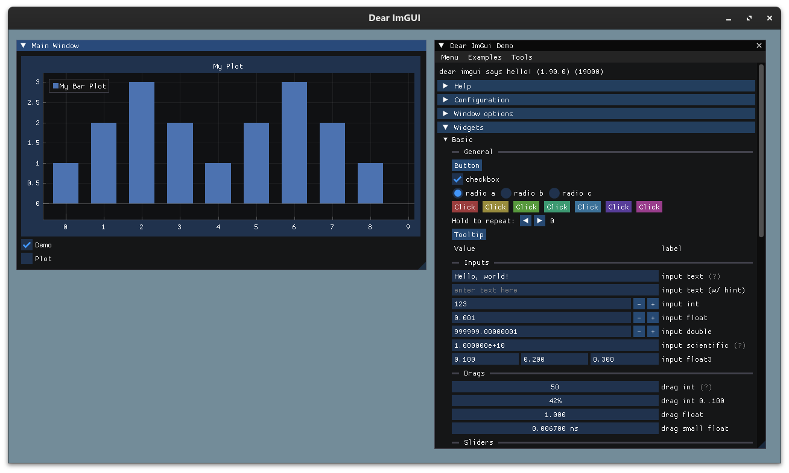

# IMGui学习笔记

imgui是轻量级UI库。

下载imgui源代码，解压后目录如下：

```bash
.IMGUI               //主要文件在根目录
├── backends         //适配的后端
├── docs
├── examples
├── imconfig.h
├── imgui.cpp
├── imgui_demo.cpp   //官方提供的Demo，展示所有UI组件
├── imgui_draw.cpp
├── imgui.h
├── imgui_internal.h
├── imgui_tables.cpp
├── imgui_widgets.cpp
├── imstb_rectpack.h
├── imstb_textedit.h
├── imstb_truetype.h
├── LICENSE.txt
└── misc
```

后端需要根据操作系统中的图形库选择，适配的图形库在backends中：

```bash
.backends
├── imgui_impl_allegro5.cpp
├── imgui_impl_allegro5.h
├── imgui_impl_android.cpp
├── imgui_impl_android.h
├── imgui_impl_dx10.cpp
├── imgui_impl_dx10.h
├── imgui_impl_dx11.cpp
├── imgui_impl_dx11.h
├── imgui_impl_dx12.cpp
├── imgui_impl_dx12.h
├── imgui_impl_dx9.cpp
├── imgui_impl_dx9.h
├── imgui_impl_glfw.cpp
├── imgui_impl_glfw.h
├── imgui_impl_glut.cpp
├── imgui_impl_glut.h
├── imgui_impl_metal.h
├── imgui_impl_metal.mm
├── imgui_impl_opengl2.cpp
├── imgui_impl_opengl2.h
├── imgui_impl_opengl3.cpp
├── imgui_impl_opengl3.h
├── imgui_impl_opengl3_loader.h
├── imgui_impl_osx.h
├── imgui_impl_osx.mm
├── imgui_impl_sdl2.cpp
├── imgui_impl_sdl2.h
├── imgui_impl_sdl3.cpp
├── imgui_impl_sdl3.h
├── imgui_impl_sdlrenderer2.cpp
├── imgui_impl_sdlrenderer2.h
├── imgui_impl_sdlrenderer3.cpp
├── imgui_impl_sdlrenderer3.h
├── imgui_impl_vulkan.cpp
├── imgui_impl_vulkan.h
├── imgui_impl_wgpu.cpp
├── imgui_impl_wgpu.h
├── imgui_impl_win32.cpp
├── imgui_impl_win32.h
└── vulkan
```

官方wiki有介绍第三方插件，本人用于数据分析，所以下载了implot这个绘图插件。

插件源代码目录如下：

```bash
.implot
├── implot.cpp
├── implot_demo.cpp    //插件作者提供的Demo，展示插件功能
├── implot.h
├── implot_internal.h
├── implot_items.cpp
├── LICENSE
├── README.md
└── TODO.md
```

准备好imgui和iimplot的源代码后，创建Cmake项目。

本人使用的项目结构如下：

```bash
.Demo
├── CMakeLists.txt
├── gui
│   ├── imgui-1.90    //imgui源代码
│   └── implot-0.16   //implot源代码
└── src
    └── main.cpp
```

根据项目结构编写CMakeLists.txt:

```makefile
cmake_minimum_required(VERSION 3.11)
 
project(DEMO)

set(CMAKE_CXX_STANDARD 11)


set(GUI_DIR ${PROJECT_SOURCE_DIR}/gui)

include_directories(
  ${GUI_DIR}/imgui-1.90
  ${GUI_DIR}/imgui-1.90/backends
  ${GUI_DIR}/implot-0.16
)

# set common source
file (GLOB SRC
     ./gui/imgui-1.90/*.h
     ./gui/imgui-1.90/*.cpp
)

file (GLOB IMPLOT_SRC
     ./gui/implot-0.16/*.h
     ./gui/implot-0.16/*.cpp
     )

if (UNIX)
    # choose backends by OS
    file (GLOB PLATFORM_SRC
        ./gui/imgui-1.90/backends/imgui_impl_glfw.*
        ./gui/imgui-1.90/backends/imgui_impl_opengl3.*
        ./src/main.cpp
    )
endif()

# generate binary
add_executable(${PROJECT_NAME} ${SRC} ${IMPLOT_SRC} ${PLATFORM_SRC})

if (UNIX)
    # need install glfw3
    target_link_libraries(${PROJECT_NAME}
        GL
        glfw # use this lib name
        dl
    )
endif()
```

然后在src目录下创建一个main.cpp文件，这个项目的准备工作就OK了，接下来开始写代码。

main.cpp内容如下：

```c++
// Sample app built with Dear ImGui and ImPlot

#include "imgui.h"
#include "imgui_impl_glfw.h"
#include "imgui_impl_opengl3.h"
#include "implot.h"
#include <stdio.h>

#include <GLFW/glfw3.h>    // Will drag system OpenGL headers


static void glfw_error_callback(int error, const char *description) {
    fprintf(stderr, "Glfw Error %d: %s\n", error, description);
}

int main(int, char **) {
    glfwSetErrorCallback(glfw_error_callback);
    if (!glfwInit())
        return 1;

    // Decide GL+GLSL versions
    // GL 3.0 + GLSL 130

    const char *glsl_version = "#version 130";
    glfwWindowHint(GLFW_CONTEXT_VERSION_MAJOR, 3);
    glfwWindowHint(GLFW_CONTEXT_VERSION_MINOR, 0);
    // glfwWindowHint(GLFW_OPENGL_PROFILE, GLFW_OPENGL_CORE_PROFILE);  // 3.2+
    // only glfwWindowHint(GLFW_OPENGL_FORWARD_COMPAT, GL_TRUE); // 3.0+ only

    // Create window with graphics context
    GLFWwindow *window = glfwCreateWindow(
            1280, 720, "Dear ImGUI", NULL, NULL);
    if (window == NULL)
        return 1;
    glfwMakeContextCurrent(window);
    glfwSwapInterval(1);    // Enable vsync

    // Setup Dear ImGui context
    IMGUI_CHECKVERSION();
    ImGui::CreateContext();
    ImPlot::CreateContext();
    ImGuiIO &io = ImGui::GetIO();
    (void) io;
    // io.ConfigFlags |= ImGuiConfigFlags_NavEnableKeyboard;     // Enable
    // Keyboard Controls io.ConfigFlags |= ImGuiConfigFlags_NavEnableGamepad; //
    // Enable Gamepad Controls

    // Setup Dear ImGui style
    ImGui::StyleColorsDark();
    // ImGui::StyleColorsLight();

    // Setup Platform/Renderer backends
    ImGui_ImplGlfw_InitForOpenGL(window, true);
    ImGui_ImplOpenGL3_Init(glsl_version);

    bool show_demo = false;
    bool show_plot_demo = false;
    ImVec4 clear_color = ImVec4(0.45f, 0.55f, 0.60f, 1.00f);

    while (!glfwWindowShouldClose(window)) {
        glfwPollEvents();

        ImGui_ImplOpenGL3_NewFrame();
        ImGui_ImplGlfw_NewFrame();
        ImGui::NewFrame();

        //Plot Data
        int bar_data[10] = {1, 2, 3,2,1,2,3,2,1};
        //float x_data[1000] = {1, 2, 3};
        //float y_data[1000] = {1, 2, 3};

        // 2. Show Main window.
            ImGui::Begin("Main Window");    // Pass a pointer to our bool variable (the
            // window will have a closing button that will
            // clear the bool when clicked)
            ImPlot::BeginPlot("My Plot");
            ImPlot::PlotBars("My Bar Plot", bar_data, 10);
            ImPlot::EndPlot();
            ImGui::Checkbox("Demo", &show_demo);
            ImGui::Checkbox("Plot", &show_plot_demo);
            ImGui::End();

        // 3. Show Demo
        if (show_demo)
            ImGui::ShowDemoWindow(&show_demo);

        if (show_plot_demo)
            ImPlot::ShowDemoWindow(&show_plot_demo);

        ImGui::Render();
        int display_w, display_h;
        glfwGetFramebufferSize(window, &display_w, &display_h);
        glViewport(0, 0, display_w, display_h);
        glClearColor(clear_color.x * clear_color.w, clear_color.y * clear_color.w,
                     clear_color.z * clear_color.w, clear_color.w);
        glClear(GL_COLOR_BUFFER_BIT);
        ImGui_ImplOpenGL3_RenderDrawData(ImGui::GetDrawData());
        glfwSwapBuffers(window);
    }

    // Cleanup
    ImGui_ImplOpenGL3_Shutdown();
    ImGui_ImplGlfw_Shutdown();
    ImPlot::DestroyContext();
    ImGui::DestroyContext();

    glfwDestroyWindow(window);
    glfwTerminate();

    return 0;
}
```

然后构建，运行结果如下图：

